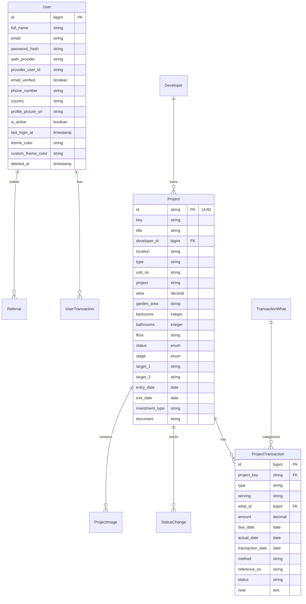

# Design Document

## Overview

This design outlines the migration strategy for moving an existing Laravel application with Filament admin interface to a new Laravel 12 project with Filament beta. The migration will be performed systematically to ensure all functionality is preserved while taking advantage of Laravel 12 and Filament beta improvements.

The current application is a real estate investment management system with the following key components:

-   User authentication with JWT support
-   Project management with UUID primary keys
-   Transaction tracking (both user and project transactions)
-   Developer management
-   Admin interface with Filament resources
-   File upload capabilities with Spatie Media Library

## Architecture

### Migration Strategy

The migration will follow a layered approach:

1. **Foundation Layer**: Set up new Laravel 12 project with proper dependencies
2. **Data Layer**: Migrate models, migrations, and database schema
3. **Business Logic Layer**: Migrate custom logic, validation, and relationships
4. **Presentation Layer**: Migrate Filament resources and admin interface
5. **Configuration Layer**: Update all configuration files for Laravel 12 compatibility

### Project Structure

```
new-laravel-project/
├── app/
│   ├── Models/
│   │   ├── Traits/
│   │   ├── User.php (with JWT implementation)
│   │   ├── Project.php (with UUID support)
│   │   ├── Developer.php
│   │   ├── ProjectTransaction.php
│   │   ├── TransactionWhat.php
│   │   ├── UserTransaction.php
│   │   ├── Referral.php
│   │   ├── StatusChange.php
│   │   ├── ProjectImage.php
│   │   └── Admin.php
│   ├── Filament/
│   │   ├── Resources/
│   │   │   ├── AdminResource.php
│   │   │   ├── DeveloperResource.php
│   │   │   ├── ProjectResource.php
│   │   │   ├── ProjectTransactionResource.php
│   │   │   ├── UserResource.php
│   │   │   └── UserTransactionResource.php
│   │   ├── Pages/
│   │   └── Widgets/
│   └── Http/
├── database/
│   ├── migrations/
│   └── seeders/
├── config/
│   ├── jwt.php
│   ├── filament.php
│   └── media-library.php
└── composer.json (updated for Laravel 12)
```

## Components and Interfaces

### Model Layer

#### User Model

-   Implements JWT authentication interface
-   Includes soft deletes functionality
-   Maintains relationships with transactions and referrals
-   Preserves custom theme color fields

#### Project Model

-   Uses UUID as primary key with custom generation logic
-   Integrates with Spatie Media Library for image handling
-   Maintains relationships with developers, transactions, and status changes
-   Includes custom validation logic

#### Transaction Models

-   ProjectTransaction with custom validation to prevent infinite recursion
-   UserTransaction for user-specific financial tracking
-   TransactionWhat as lookup table for transaction categories

#### Supporting Models

-   Developer model for project ownership
-   Admin model for administrative users
-   Referral model for user referral tracking
-   StatusChange model for project status history

### Filament Resources Layer

#### Resource Structure

Each Filament resource will be updated to use Filament beta syntax:

-   Form schemas with updated component syntax
-   Table configurations with new column and filter syntax
-   Infolist configurations for detailed views
-   Relationship managers where applicable

#### Key Updates for Filament Beta

-   Updated form component imports and syntax
-   New table column and action syntax
-   Updated resource page configurations
-   Improved relationship handling

### Authentication Layer

#### JWT Integration

-   Maintain JWT authentication for API endpoints
-   Preserve custom JWT claims and token handling
-   Update JWT configuration for Laravel 12 compatibility

#### Multi-Guard Authentication

-   Separate authentication for regular users and admins
-   Maintain existing authentication providers

## Data Models

### Core Entities



### Relationship Mapping

-   **User → UserTransaction**: One-to-Many
-   **User → Referral**: One-to-Many
-   **Developer → Project**: One-to-Many
-   **Project → ProjectTransaction**: One-to-Many (via key field)
-   **Project → StatusChange**: One-to-Many
-   **TransactionWhat → ProjectTransaction**: One-to-Many

## Error Handling

### Migration Error Handling

1. **Dependency Conflicts**: Handle version conflicts between Laravel 12 and existing packages
2. **Syntax Deprecation**: Update deprecated Laravel and Filament syntax
3. **Database Migration Issues**: Handle foreign key constraints and data type changes
4. **File Upload Configuration**: Update storage and media library configurations

### Runtime Error Handling

1. **Model Validation**: Preserve existing validation logic while updating for Laravel 12
2. **Authentication Errors**: Maintain JWT error handling and token validation
3. **File Upload Errors**: Handle media library integration errors
4. **Database Connection**: Maintain robust database error handling

## Testing Strategy

### Migration Testing

1. **Model Testing**: Verify all model relationships and methods work correctly
2. **Database Testing**: Ensure all migrations run successfully and data integrity is maintained
3. **Filament Resource Testing**: Test all admin interface functionality
4. **Authentication Testing**: Verify JWT authentication and multi-guard setup

### Compatibility Testing

1. **Laravel 12 Compatibility**: Test all Laravel 12 specific features and syntax
2. **Filament Beta Compatibility**: Verify all Filament components work with beta version
3. **Package Integration**: Test all third-party package integrations
4. **File Upload Testing**: Verify media library and file upload functionality

### Performance Testing

1. **Query Performance**: Ensure model relationships perform efficiently
2. **File Upload Performance**: Test media library performance with large files
3. **Admin Interface Performance**: Verify Filament resources load efficiently

## Implementation Considerations

### Laravel 12 Specific Updates

1. **Routing**: Update route syntax for Laravel 12
2. **Middleware**: Update middleware configurations
3. **Service Providers**: Update service provider syntax
4. **Configuration**: Update all config files for Laravel 12 compatibility

### Filament Beta Updates

1. **Component Syntax**: Update all form and table components
2. **Resource Structure**: Update resource class structure
3. **Navigation**: Update navigation configuration
4. **Theming**: Update theme and styling configurations

### Package Compatibility

1. **JWT Auth**: Ensure tymon/jwt-auth works with Laravel 12
2. **Spatie Media Library**: Update to compatible version
3. **Filament Spatie Plugin**: Update to beta-compatible version

### Security Considerations

1. **Authentication**: Maintain secure JWT implementation
2. **File Uploads**: Ensure secure file upload handling
3. **Database**: Maintain proper database security practices
4. **Admin Access**: Preserve admin authentication security
