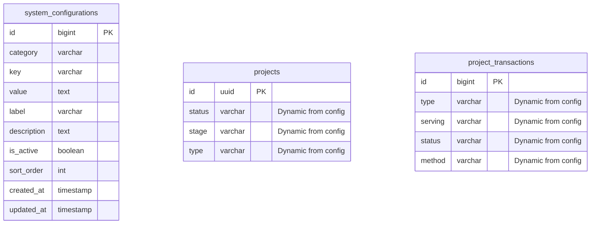

# Design Document

## Overview

This design document outlines the technical approach for enhancing the real estate project management system with dynamic configuration capabilities, simplified project statuses, redesigned reports, theme switcher fixes, new widgets, and realistic seed data. The solution will transform hardcoded constants into database-driven configurations while maintaining system integrity and performance.

## Architecture

### Configuration Management System

The system will implement a flexible configuration management architecture using:

-   **Configuration Models**: Database models to store dynamic configuration values
-   **Configuration Service**: Centralized service to manage and cache configuration data
-   **Configuration Repository**: Data access layer for configuration operations
-   **Configuration Events**: Event system to notify components of configuration changes

### Database Schema Changes



### Report Architecture

The project reports will mirror the financial report structure:

-   **Monthly Grid Layout**: Months as columns, metrics as rows
-   **Data Aggregation Service**: Service to aggregate project data by month
-   **Report Cache**: Cached report data for performance
-   **Export Functionality**: PDF/Excel export matching financial report format

## Components and Interfaces

### 1. Configuration Management

#### SystemConfiguration Model

```php
class SystemConfiguration extends Model
{
    protected $fillable = [
        'category', 'key', 'value', 'label',
        'description', 'is_active', 'sort_order'
    ];

    public function scopeByCategory($query, $category);
    public function scopeActive($query);
}
```

#### ConfigurationService

```php
class ConfigurationService
{
    public function getConfigurationsByCategory(string $category): Collection;
    public function updateConfiguration(string $category, string $key, string $value): bool;
    public function addConfiguration(array $data): SystemConfiguration;
    public function deleteConfiguration(int $id): bool;
    public function canDeleteConfiguration(int $id): bool;
}
```

### 2. Settings Page (Filament)

#### SettingsResource

-   Tabbed interface for different configuration categories
-   Theme switcher integration
-   Real-time validation and feedback
-   Bulk operations for configuration management

#### Configuration Categories

-   **Project Statuses**: "exited", "on-going" (default)
-   **Project Stages**: holding, buying, selling, etc.
-   **Transaction Types**: Dynamic transaction categories
-   **Transaction Serving**: asset, operation, etc.
-   **Transaction Methods**: Payment methods
-   **Property Types**: Apartment, villa, etc.

### 3. Project Reports Enhancement

#### ProjectReportService

```php
class ProjectReportService
{
    public function generateMonthlyReport(array $filters): array;
    public function getProjectMetricsByMonth(string $yearMonth): array;
    public function exportReport(string $format, array $data): mixed;
}
```

#### Report Structure

-   **Columns**: Jan, Feb, Mar, ..., Dec
-   **Rows**:
    -   New Projects
    -   Exited Projects
    -   On-going Projects
    -   Total Investment
    -   Revenue Generated
    -   Active Transactions

### 4. Theme Switcher Fix

#### Frontend Implementation

```javascript
class ThemeManager {
    constructor() {
        this.initializeTheme();
        this.bindEvents();
    }

    initializeTheme() {
        const savedTheme = localStorage.getItem("theme") || "system";
        this.applyTheme(savedTheme);
    }

    toggleTheme() {
        const currentTheme = this.getCurrentTheme();
        const newTheme = currentTheme === "dark" ? "light" : "dark";
        this.applyTheme(newTheme);
        localStorage.setItem("theme", newTheme);
    }

    applyTheme(theme) {
        document.documentElement.setAttribute("data-theme", theme);
        this.updateThemeIcon(theme);
    }
}
```

### 5. Dashboard Widgets

#### ProjectStatusWidget

-   Pie chart showing distribution of project statuses
-   Real-time updates based on current configuration

#### TransactionSummaryWidget

-   Monthly transaction summary
-   Revenue vs Expense breakdown
-   Dynamic categories from configuration

#### RecentActivityWidget

-   Recent project status changes
-   Recent transactions
-   System configuration changes

#### TrendAnalysisWidget

-   Project entry/exit trends
-   Transaction volume trends
-   Performance metrics

### 6. Seed Data Enhancement

#### Enhanced Seeders

```php
class ProjectSeeder extends Seeder
{
    public function run()
    {
        $this->seedProjects();
        $this->seedTransactions();
        $this->seedRealisticDates();
    }

    private function seedRealisticDates()
    {
        // Generate dates within last 12 months
        // Distribute data across months for trend analysis
    }
}
```

## Data Models

### SystemConfiguration

-   **category**: Configuration category (project_statuses, transaction_types, etc.)
-   **key**: Unique identifier within category
-   **value**: Configuration value
-   **label**: Display label for UI
-   **description**: Optional description
-   **is_active**: Enable/disable flag
-   **sort_order**: Display order

### Enhanced Project Model

-   Remove hardcoded constants
-   Use dynamic configuration for status, stage, type
-   Maintain backward compatibility

### Enhanced ProjectTransaction Model

-   Dynamic transaction types from configuration
-   Dynamic serving types from configuration
-   Dynamic status values from configuration

## Error Handling

### Configuration Validation

-   Prevent deletion of configurations in use
-   Validate configuration values before saving
-   Handle configuration cache invalidation

### Report Generation

-   Handle missing data gracefully
-   Provide fallback values for empty months
-   Error recovery for report generation failures

### Theme Switching

-   Fallback to system theme on errors
-   Graceful degradation for unsupported browsers
-   Error logging for theme-related issues

## Testing Strategy

### Unit Tests

-   Configuration service methods
-   Report generation logic
-   Theme switcher functionality
-   Widget data aggregation

### Integration Tests

-   Settings page functionality
-   Configuration changes affecting forms
-   Report export functionality
-   Widget real-time updates

### Feature Tests

-   End-to-end configuration management
-   Report generation and export
-   Theme persistence across sessions
-   Dashboard widget interactions

### Seed Data Tests

-   Verify realistic date distribution
-   Validate data relationships
-   Test data volume and variety

## Performance Considerations

### Configuration Caching

-   Cache frequently accessed configurations
-   Invalidate cache on configuration changes
-   Use Redis for distributed caching

### Report Performance

-   Cache generated reports
-   Implement pagination for large datasets
-   Optimize database queries with indexes

### Widget Performance

-   Cache widget data with appropriate TTL
-   Use database views for complex aggregations
-   Implement lazy loading for dashboard

## Security Considerations

### Configuration Access

-   Role-based access to settings page
-   Audit logging for configuration changes
-   Validation of configuration values

### Data Integrity

-   Prevent orphaned references
-   Validate configuration dependencies
-   Backup before configuration changes

## Migration Strategy

### Database Migrations

1. Create system_configurations table
2. Migrate existing constants to database
3. Update existing models to use dynamic configuration
4. Add indexes for performance

### Code Migration

1. Replace hardcoded constants with configuration service calls
2. Update Filament resources to use dynamic options
3. Implement configuration caching
4. Update seeders with realistic data

## Deployment Considerations

### Configuration Seeding

-   Seed default configurations during deployment
-   Provide migration path for existing data
-   Handle configuration conflicts

### Cache Warming

-   Pre-populate configuration cache
-   Warm report cache with common queries
-   Initialize theme preferences
